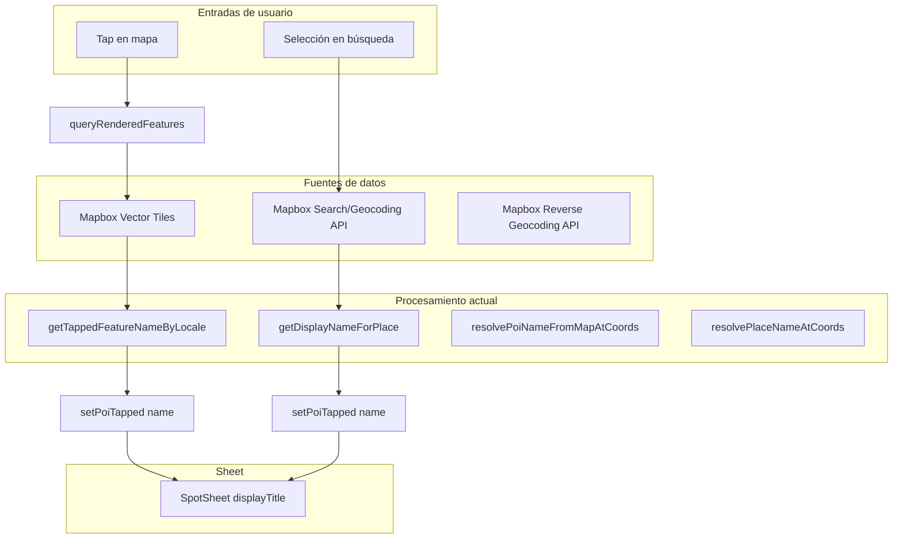

# OL-EXPLORE-LOCALE-CONSISTENCY-001: Arquitectura de idioma (mapa, búsqueda, sheet)

**Loop:** OL-EXPLORE-LOCALE-CONSISTENCY-001  
**Referencia:** Bitácora 297  
**Objetivo:** Consistencia de idioma entre mapa, nombre seleccionado y dirección para POI.

---

## 1. Flujo completo

### Rutas resumidas

- **Map tap:** `queryRenderedFeatures` → tiles (name, name_es, name_en) → priorización por capa label + locale → `poiTapped.name` → SpotSheet.
- **Search:** PlaceResult (name, opcional name_es/name_en) → `getDisplayNameForPlace` → si CJK/cirílico: `resolvePlaceNameAtCoords` (reverse) → `poiTapped.name` → SpotSheet.

---

## 2. Fuente de verdad

| Concepto | Definición |
|----------|------------|
| **Locale efectivo** | `lib/i18n/locale-config.ts` → `getCurrentLanguage()` (único punto de lectura). |
| **Idioma objetivo POI** | `es` o `en` según locale; orden de preferencia `name_es` > `name_en` > `name`. |
| **APIs Mapbox** | Todas las llamadas deben pasar `language` consistente con locale (searchPlaces, searchPlacesPOI, mapbox-geocoding). |

---

## 3. Estrategia unificada

1. **Map tap:** Priorizar features de capas `place-label*`/`poi-label*` y con `name_es`/`name_en`; usar `getTappedFeatureNameByLocale`.
2. **Search:** Usar `getDisplayNameForPlace`; si resultado en script no latino, fallback con reverse geocoding (requiere robustecer selección de feature).
3. **Reverse geocoding:** Usar `context` (country, region, place) con preferencia por `translations[lang]`; fallback a `feature.properties.name`.

---

## 4. Limitaciones documentadas

| Limitación | Descripción |
|------------|-------------|
| **Cobertura Mapbox** | Mapbox puede no tener traducciones para todos los lugares (p.ej. localidades en Japón). |
| **Orden reverse** | El primer resultado del reverse puede ser muy específico (dirección) y sin traducción. |
| **Tiles vs API** | Los tiles y Search/Reverse pueden devolver nombres distintos para el mismo punto. |
| **poi-label oculta** | La capa `poi-label` está oculta por diseño; solo `place-label` aporta labels en tap. |
| **Multiidioma futuro** | Las heurísticas basadas en "script latino" no escalan a ja/zh/ru como idiomas de app. |

---

## 5. Archivos involucrados

| Archivo | Función |
|---------|---------|
| `lib/i18n/locale-config.ts` | `getCurrentLanguage()`, `getCurrentLocale()` |
| `lib/explore/map-screen-orchestration.ts` | `getTappedFeatureNameByLocale`, `getDisplayNameForPlace`, `resolvePoiNameFromMapAtCoords`, `containsNonLatinScript` |
| `lib/mapbox-geocoding.ts` | `resolveAddress`, `resolvePlaceNameAtCoords` |
| `lib/places/searchPlaces.ts` | `searchPlaces` (language param) |
| `lib/places/searchPlacesPOI.ts` | searchBoxForward (language param) |
| `lib/map-core/constants.ts` | `getLabelLayerScore`, `LABEL_LAYER_PREFIXES` |
| `components/explorar/MapScreenVNext.tsx` | `handleMapClick`, `handleCreateFromPlace`, `poiTapped` |
| `components/explorar/SpotSheet.tsx` | `displayTitleOverride`, `displayTitle` |

---

## 6. Próximos pasos

- ~~Robustecer `resolvePlaceNameAtCoords`: iterar features y preferir `place_type` country/region~~ — Implementado: usa `context.country` → `region` → `place` con traducciones.
- ~~Dirección en japonés tras tap POI~~ — Resuelto (bitácora 298): `resolveAddress` hace primera llamada con `types=place,region,country` + `language=en`; toma primer feature en script latino; fallback a llamada sin types.

---

## 7. Mapbox Geocoding v6 Reverse (fuente: docs oficiales)

Investigación de la documentación de Mapbox Geocoding v6 (2026-03):

### Orden de features

- Reverse devuelve features de **más específica a más amplia** (address → street → ... → region → country).
- Con `limit=1` (default) solo devuelve **una** feature: la más específica (address/street).
- `feature.properties.name` corresponde a esa feature — en regiones CJK suele estar en script local.

### Objeto context

- Cada feature tiene `properties.context` con la jerarquía geográfica completa.
- Incluye: `country`, `region`, `place`, `district`, `locality`, `neighborhood`, etc.
- Cada nivel tiene `name` y, con `language=es,en`, `translations` por idioma.

### Parámetro language

- `language=es,en` hace que Mapbox añada `translations` en cada nivel del `context`.
- Ejemplo: `context.country.translations.es.name`, `context.country.translations.en.name`.

### Solución adoptada

- Usar `context.place` → `context.region` → `context.country` en ese orden (más específico primero).
- Preferir `translations[lang]` > `translations.en` > `name` por nivel.
- Fallback final: `feature.properties.name`.
