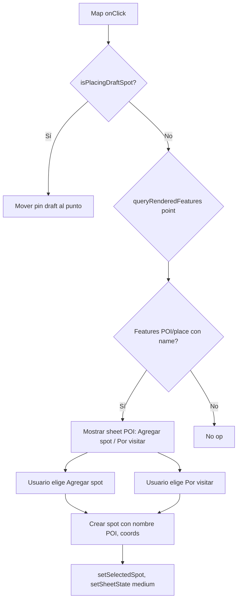

# Plan: POI tap-to-add + Mapbox Standard 3D

**Estado:** DEPRECATED (2026-02-25)  
**Nombre:** POI Tap + Mapbox Standard 3D  
**Resumen histórico:** Este plan documenta la etapa en la que se evaluó Mapbox Standard como predeterminado.

> **Decisión actual (2026-02-25):** Explore queda **FLOWYA-only** (Mapbox Studio).  
> Se elimina la bifurcación de estilos y el toggle de versiones de mapa en código.  
> Este plan se conserva solo como referencia histórica; no usar para ejecución futura.

---

## Contexto

- **Problema actual:** Tap en POI de Mapbox no hace nada; labels parcialmente en inglés; estado "bloqueado" percibido.
- **Decisión:** Usar Mapbox Standard como predeterminado (mejor compatibilidad con plugin idioma, POI interactions, 3D) y dejar FLOWYA como alternativa vía toggle.
- **Mapbox Standard:** Incluye 3D buildings y objetos por defecto; soporta `show3dBuildings`, `show3dObjects`, pitch/bearing; genera algunas alertas en consola pero no bloquean funcionalidad.

---

## Parte 1: Estilo predeterminado + 3D

### 1.1 Cambiar predeterminado a Mapbox Standard

- En [.env](../.env): `EXPO_PUBLIC_USE_CORE_MAP_STYLES=true` (Standard como predeterminado).
- Actualizar bitácora 107 para reflejar que Standard es ahora el estilo recomendado por defecto.

### 1.2 Habilitar 3D explícito

- En [lib/map-core/constants.ts](../lib/map-core/constants.ts): nueva función `enable3DBuildingsAndObjects(map)` que llame:
  - `map.setConfigProperty('basemap', 'show3dBuildings', true)` (o equivalente según API Standard).
  - `map.setConfigProperty('basemap', 'show3dObjects', true)` si existe.
- En [hooks/useMapCore.ts](../hooks/useMapCore.ts): en `onMapLoad`, cuando `useCoreMapStyles === true`, llamar a `enable3DBuildingsAndObjects(map)`.

### 1.3 Pitch inicial + control de navegación 3D

- En [lib/map-core/constants.ts](../lib/map-core/constants.ts): añadir `INITIAL_PITCH` (ej. 45) y opcionalmente `INITIAL_BEARING` (0).
- En [components/explorar/MapScreenVNext.tsx](../components/explorar/MapScreenVNext.tsx): extender `FALLBACK_VIEW` / `initialViewState` para incluir `pitch` y `bearing` cuando se usa Standard.
- En [components/explorar/MapCoreView.tsx](../components/explorar/MapCoreView.tsx): importar y renderizar `NavigationControl` de react-map-gl:
  - Props: `showCompass={true}`, `showZoom={true}`, `visualizePitch={true}`, `position="top-right"` (o posición que no choque con MapControls).
- Revisar layout: MapControls está en overlay (bottom-right); colocar NavigationControl dentro del Map, ej. top-right, para que no se solapen.

---

## Parte 2: Flujo tap en POI (Agregar spot / Por visitar)

### 2.1 Extender onClick con point para queryRenderedFeatures

- El Map de react-map-gl pasa `MapLayerMouseEvent` a `onClick`, que incluye `point` (x, y píxeles) y `lngLat`.
- En [MapCoreView.tsx](../components/explorar/MapCoreView.tsx): cambiar la firma de `onClick` para aceptar el evento completo (o al menos `{ lngLat, point }`).
- En [MapScreenVNext.tsx](../components/explorar/MapScreenVNext.tsx): `handleMapClick` debe recibir el evento completo para poder llamar a `map.queryRenderedFeatures(e.point)`.

### 2.2 Obtener instancia del mapa en handleMapClick

- `handleMapClick` se ejecuta en MapScreenVNext pero necesita la instancia de Mapbox (`map`). Actualmente `mapInstance` está en `useMapCore` y se expone vía el retorno del hook.
- MapScreenVNext ya tiene acceso a `mapCore.mapInstance`. Usar esa referencia en `handleMapClick`.

### 2.3 Lógica de handleMapClick ampliada

- Cuando no es `isPlacingDraftSpot`:
  1. Llamar `mapInstance.queryRenderedFeatures(e.point)`.
  2. Filtrar features por capas de POI/place (layer.id que contengan "poi", "place", "symbol", etc.; Mapbox Standard usa namespaces como `poi` del basemap).
  3. De la feature elegida: extraer `properties.name` (o similar), coordenadas del geometry.
  4. Si hay feature válida con nombre: mostrar bottom sheet o modal con dos opciones: **"Agregar spot"** y **"Agregar a por visitar"**.
  5. Al elegir: crear spot mínimo (`title` = nombre POI, `latitude`, `longitude`), insert en Supabase; si "Por visitar", crear también fila en `pins` con `status: 'to_visit'`.
  6. `setSpots(prev => [...prev, created])`, `setSelectedSpot(created)`, `setSheetState('medium')`.

### 2.4 UI: sheet de acciones POI

- Opciones:
  - **A)** Bottom sheet pequeño (estilo action sheet) con dos botones.
  - **B)** Modal de confirmación reutilizando `ConfirmModal` o similar.
- Recomendación: sheet compacto tipo action sheet para mantener coherencia con el resto de la app.

### 2.5 Evitar conflicto con tap en Marker de Flowya

- Los Markers tienen `onClick` que captura el evento antes que el Map. Si el usuario toca un Marker de Flowya, se ejecutará `handlePinClick`, no `handleMapClick`. No hay conflicto.
- Si el usuario toca un POI de Mapbox (sin Marker encima), el evento llega al Map y se procesa en `handleMapClick`.

### 2.6 Crear spot desde POI

- Reutilizar lógica de [handleCreateSpotFromDraft](../components/explorar/MapScreenVNext.tsx): insert en `spots`, `resolveAddress` en background.
- La diferencia: el payload inicial tiene `title` pre-rellenado con el nombre del POI.
- Para "Por visitar": tras crear el spot, insert en `pins` con `status: 'to_visit'` (o el equivalente en el modelo actual: `saved`, `visited` según [lib/pins.ts](../lib/pins.ts)).

---

## Parte 3: Archivos a modificar

| Archivo | Cambios |
|---------|---------|
| [.env](../.env) | `EXPO_PUBLIC_USE_CORE_MAP_STYLES=true` |
| [lib/map-core/constants.ts](../lib/map-core/constants.ts) | `enable3DBuildingsAndObjects`, `INITIAL_PITCH`, constantes para capas POI |
| [hooks/useMapCore.ts](../hooks/useMapCore.ts) | Llamar `enable3DBuildingsAndObjects` cuando useCoreMapStyles |
| [components/explorar/MapCoreView.tsx](../components/explorar/MapCoreView.tsx) | Añadir NavigationControl; extender tipo de onClick para incluir point |
| [components/explorar/MapScreenVNext.tsx](../components/explorar/MapScreenVNext.tsx) | initialViewState con pitch; handleMapClick ampliado; sheet POI; handler crear spot desde POI |
| Nuevo componente (opcional) | `POIActionSheet` o integrar en sheet existente |
| [docs/bitacora/2026/02/107-mapa-light-v11-idioma-agua.md](../bitacora/2026/02/107-mapa-light-v11-idioma-agua.md) | Actualizar estado: Standard predeterminado, 3D habilitado, flujo POI |

---

## Parte 4: Alineación visual de pines con Mapbox

Objetivo: que los pines de spots (MapPinSpot, MapPinCreating, MapPinExisting) y sus labels sigan los lineamientos visuales de Mapbox en tamaño, tipografía, posición y comportamiento, para una experiencia integrada con el mapa base.

### 4.1 Estado actual vs Mapbox

| Aspecto | Actual (map-pins.tsx) | Mapbox Standard (referencia) |
|---------|------------------------|-----------------------------|
| Pin reposo | 12px círculo | POI base ~16–20px icono |
| Pin seleccionado | 36px círculo | POI destacado ~28–36px |
| Label font-size | 10–11px | 11–13px típico symbol layer |
| Label font | Sistema (no especificado) | DIN Pro, Barlow, Inter en estilos Mapbox |
| Label halo/outline | Ninguno | text-halo para legibilidad sobre mapa |
| Label posición | Debajo del pin, gap 2px | Debajo o lateral, text-anchor top |

### 4.2 Micro-scopes: tipografía de labels

- **4.2.1** Cargar fuente que aproxime Mapbox (ej. Inter, Open Sans o Barlow vía Google Fonts / expo-font). Definir constante `MAP_PIN_LABEL_FONT` en theme o constants.
- **4.2.2** Ajustar `fontSize` labels: 11–12px reposo, 12–13px seleccionado (alineado a Mapbox symbol text-size 11–14).
- **4.2.3** Añadir `textShadow` (halo) a los labels para legibilidad sobre el mapa: sombra suave o stroke simulado (Mapbox usa `text-halo-width` y `text-halo-color`).
- **4.2.4** Ajustar `fontWeight`: 500 reposo, 600 seleccionado (similar a Mapbox SemiBold para labels de POI).

### 4.3 Micro-scopes: tamaño y forma del pin

- **4.3.1** Aumentar `SPOT_PIN_SIZE` de 12 a 14–16px para acercarse al tamaño de iconos POI base de Mapbox.
- **4.3.2** Reducir `SPOT_PIN_SELECTED_SIZE` de 36 a 32px si se percibe demasiado grande respecto a POIs destacados de Mapbox.
- **4.3.3** Ajustar `PIN_LABEL_GAP` (distancia pin–label) a 3–4px para alinear con `text-offset` típico de Mapbox.
- **4.3.4** Considerar `anchor` del Marker: actualmente `center`; asegurar que el punto de anclaje coincida con el centro visual del pin para que el label quede alineado correctamente.

### 4.4 Micro-scopes: posición y comportamiento

- **4.4.1** Label siempre debajo del pin (`flexDirection: column`, `alignItems: center`) — ya implementado; validar que no haya desalineación al cambiar tamaños.
- **4.4.2** Mantener `maxWidth` del label para evitar desbordes; valores 80–100px son razonables; Mapbox limita por `text-max-width`.
- **4.4.3** Comportamiento de zoom: Mapbox usa `text-size` con expresión `interpolate` por zoom. Opcional: escalar ligeramente fontSize del label según zoom del mapa (requiere pasar zoom a MapPinSpot). Scope opcional para fase 2.

### 4.5 Opción avanzada: Symbol layer nativo

Mapbox recomienda Symbol layers para grandes conjuntos de puntos: mejor rendimiento, estilo unificado, tipografía nativa.

- **Riesgos:**
  - Refactor significativo: sustituir Markers por GeoJSON source + Symbol layer.
  - Estados visuales por spot (to_visit, visited, selected) requieren data-driven styling o feature-state; más complejo que componentes React.
  - Click handling: hay que usar `queryRenderedFeatures` o `map.on('click', 'layer-id', ...)` en vez de onClick del Marker.
  - Menos flexibilidad para animaciones (scale, opacity) que con React Native Reanimated.
- **Beneficios:**
  - Integración tipográfica total (mismas fuentes que el mapa).
  - Escalabilidad: cientos de spots sin degradar rendimiento.
  - Comportamiento nativo de labels (colisión, prioridad) gestionado por Mapbox.
- **Recomendación:** Mantener Markers en esta fase; documentar Symbol layer como evolución futura si se superan ~200–300 spots en pantalla.

### 4.6 Archivos a modificar (Parte 4)

| Archivo | Cambios |
|---------|---------|
| [components/design-system/map-pins.tsx](../components/design-system/map-pins.tsx) | Constantes de tamaño, tipografía, halo; estilos de labels y pins |
| [constants/theme.ts](../constants/theme.ts) o nuevo archivo | `MAP_PIN_LABEL_FONT`, constantes de tipografía para mapa |
| index.html o head de web | Cargar fuente (Inter/Open Sans) si no está ya |
| [lib/map-core/constants.ts](../lib/map-core/constants.ts) | Opcional: `MAP_PIN_LABEL_FONT_SIZE_REPOSO`, `MAP_PIN_LABEL_FONT_SIZE_SELECTED` para reutilizar |

---

## Consideraciones técnicas

- **Capas Mapbox Standard:** Los POI pueden venir de featuresets como `poi` (basemap). Los `layer.id` o `source` pueden variar; habrá que iterar sobre `queryRenderedFeatures` y priorizar features con `properties.name` de capas que parezcan POI/place. Documentar los layer IDs que funcionen en una constante.
- **Orden de eventos:** Confirmar que en web/touch el click del Map no es consumido por los Markers cuando el tap es en un POI sin Marker encima.
- **Auth:** El flujo "Agregar spot" y "Por visitar" debe pasar por `requireAuthOrModal` igual que el resto de creación de contenido.
- **Pines:** Priorizar ajustes incrementales (tipografía, tamaño, halo) sobre migración a Symbol layer en esta fase.

---

## Resumen: Micro-scopes por parte

| Parte | Micro-scope | Descripción |
|-------|-------------|-------------|
| 1 | 1.1 | Cambiar EXPO_PUBLIC_USE_CORE_MAP_STYLES=true |
| 1 | 1.2 | enable3DBuildingsAndObjects en onMapLoad |
| 1 | 1.3 | INITIAL_PITCH, NavigationControl con visualizePitch |
| 2 | 2.1 | onClick con point; handleMapClick recibe evento completo |
| 2 | 2.2 | Usar mapInstance en handleMapClick |
| 2 | 2.3 | queryRenderedFeatures + filtrado POI + lógica crear spot |
| 2 | 2.4 | UI sheet Agregar spot / Por visitar |
| 2 | 2.5 | Validar no conflicto con Markers |
| 2 | 2.6 | Reutilizar handleCreateSpotFromDraft; pins to_visit |
| 3 | — | Archivos: .env, constants, useMapCore, MapCoreView, MapScreenVNext, bitácora |
| 4 | 4.2.1 | Cargar fuente Inter/Open Sans; MAP_PIN_LABEL_FONT |
| 4 | 4.2.2 | fontSize labels 11–12 / 12–13px |
| 4 | 4.2.3 | textShadow (halo) en labels |
| 4 | 4.2.4 | fontWeight 500 / 600 |
| 4 | 4.3.1 | SPOT_PIN_SIZE 14–16px |
| 4 | 4.3.2 | SPOT_PIN_SELECTED_SIZE 32px (opcional) |
| 4 | 4.3.3 | PIN_LABEL_GAP 3–4px |
| 4 | 4.3.4 | Validar anchor Marker |
| 4 | 4.4.1 | Validar alineación label debajo del pin |
| 4 | 4.4.2 | maxWidth 80–100px |

---

## Todos (checklist)

- [ ] style-default: Cambiar EXPO_PUBLIC_USE_CORE_MAP_STYLES=true en .env
- [ ] enable-3d: Añadir enable3DBuildingsAndObjects y INITIAL_PITCH en constants.ts
- [ ] nav-control: Añadir NavigationControl con visualizePitch en MapCoreView
- [ ] initial-pitch: Incluir pitch/bearing en initialViewState cuando use Standard
- [ ] onclick-point: Extender onClick para pasar point; handleMapClick recibe evento completo
- [ ] query-poi: Implementar queryRenderedFeatures y filtrado de features POI
- [ ] poi-sheet: Crear UI sheet/modal Agregar spot / Por visitar
- [ ] create-from-poi: Lógica crear spot desde POI (insert + pin to_visit si aplica)
- [ ] bitacora: Actualizar bitácora 107 con Standard predeterminado y flujo POI
- [ ] pin-typography: Micro 4.2 — Tipografía labels (font, size, halo, weight)
- [ ] pin-size: Micro 4.3 — Tamaño y gap pin-label
- [ ] pin-position: Micro 4.4 — Posición y maxWidth label
